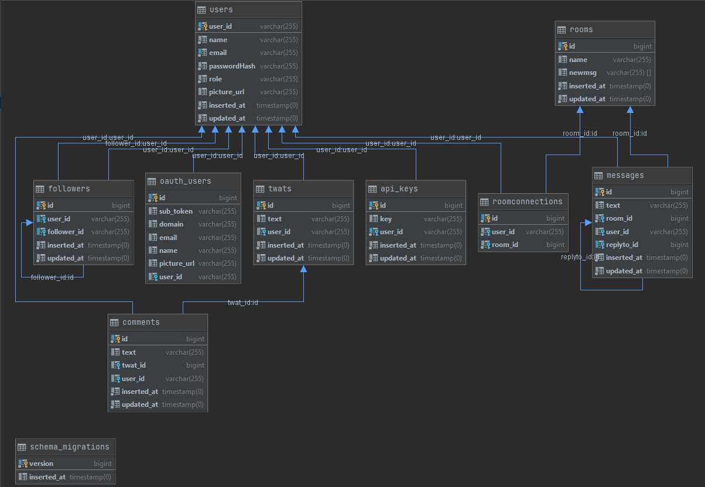

# Twitterclone.Umbrella




Clone the repository

```bash
git clone https://github.com/ucll-internet-programming-major/project-jan-Laurens54321.git
```

Configure your database in dev.exs (using MySQL)

Run the migrations

```bash
mix ecto.reset
```

And run the project

```bash
iex -S mix phx.server
```

default users:
```
user: user, password: t
user: admin, password: t
user: manager, password: t
```